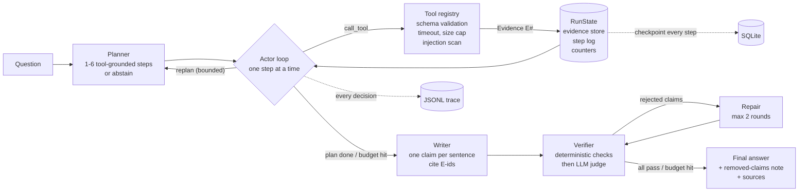

# finclaim-agent

A financial research agent that **checks every claim it makes against the evidence it gathered** before showing it to you, plus the eval harness used to measure whether that actually works.

LLM research agents fail in a predictable way: the answer reads well, cites a source, and the number in it is wrong or invented. `finclaim` treats the final answer as a set of claims to verify, not text to trust. Each sentence must cite an evidence id; numbers must appear in the cited evidence; tool output that tries to give the agent instructions is quarantined; anything that fails is repaired or dropped, and the user is told what was removed.

The agent, verifier and harness are ~1,600 lines of standard-library Python. No agent framework, no vector DB, no required dependencies, so the whole control flow is readable in one sitting and runs without internet egress against recorded fixtures.

```
python -m finclaim ask "How has NOVX stock performed over the last year?" \
    --provider mock --fixtures evals/fixtures/universe.json

NOVX close 2025-10-01: 412.50 [E1]. Close 2026-09-30: 538.20 [E1]. Change over 1y: 30.47% [E1].
Insufficient evidence: no source supports a forward revenue estimate.

Sources:
[E1] fixture:prices via price_history
```
The first draft also said revenue would "grow 37% next year" with no citation. The verifier rejected it and the repair step replaced it with an explicit abstention.

## Architecture



### Planner and reasoning loop
The run is an explicit state machine over `plan -> act -> synthesize -> verify -> done`, not a free-running ReAct loop. The planner produces 1-6 steps, each tied to one tool, or an empty plan with a reason when the question cannot be answered with the tools (price predictions, "should I buy"). The actor works one step at a time and returns one of four structured actions: `call_tool`, `step_done`, `step_failed`, `replan`. All model output is parsed as JSON and validated (including tool arguments against the tool schema); a validation error is fed back to the model for a bounded number of self-repairs.

Hard budgets keep the loop from running away: global tool-loop turns, attempts per step, one replan, two repair rounds, and a wall-clock limit. When a budget is hit, remaining steps are marked `skipped` and the agent writes up what it has instead of failing silently.

### Tools
`price_history`, `fundamentals` (yfinance), `filings_facts` (SEC EDGAR XBRL), `news` (Google News RSS), `calculate` (AST-sandboxed arithmetic so derived numbers are computed, not guessed). Each tool has a versioned schema, a timeout, and an output size cap. Backends are swappable: live, recorded fixtures, or a fault injector that wraps either.

### Memory and state
- **Evidence store**: each tool result is stored once with a stable id (`E1`, `E2`...). Prompts reference evidence by id and a one-line gist; full text is only loaded for the writer and the judge, scoped to the ids they need.
- **Working memory**: the step log keeps the latest entries verbatim and compacts older ones into one line per finished step, newest first, under a hard character budget.
- **Call index**: a normalized signature of every tool call maps to its evidence id. A repeated call is never re-executed; the agent is told where the result already is, and a step that keeps repeating itself is force-closed.
- **Checkpoints**: the full `RunState` is serialized to SQLite after every unit of work. `python -m finclaim resume <run_id>` continues a crashed run from the last checkpoint without repeating completed tool calls (covered by a test that kills the process mid-run).
- **Trace**: every plan, decision, tool call, verification round and repair is emitted as JSONL. It is the debugging surface and the input to the eval harness.

### Verifier
The draft is split into one claim per sentence. Cheap, exact checks run first and cannot be argued with:

| check | failure label |
|---|---|
| sentence has a citation | `missing_citation` |
| cited id exists | `bad_citation` |
| cited evidence is not injection-flagged | `tainted_citation` |
| every number in the claim appears in the cited evidence (units normalised: million/billion/crore/lakh, ratio vs percent, 0.5% tolerance; years ignored) | `unsupported_number` |

Claims that pass go to an LLM judge in one batched call (`SUPPORTED / CONTRADICTED / NOT_ENOUGH_INFO`), which catches right-number-wrong-metric errors. Rejected claims go to a repair prompt; after the repair budget, anything still failing is dropped and the user is told how many claims were removed. Sentences starting with `Insufficient evidence:` are allowed through, so abstaining is always a valid path.

## Evaluation

```
python -m evals.harness --provider groq --label groq-llama70b                  # full suite
python -m evals.harness --provider groq --no-verify --label ablation-noverify  # verifier off
python -m evals.harness --provider groq --baseline evals/results/groq-llama70b.json  # regression gate
python -m evals.harness --provider groq --repeats 3                            # variance
```

The suite runs against **fictional companies** (NOVX, KRLA, ORBT) with recorded tool responses. A model cannot answer from memorised training data, so the only way to pass is to call the tools and cite them, and results do not drift with the market.

Tasks cover single-tool lookups, unit handling, multi-step comparison, a tool that always times out, random tool failures (fault injector, seeded), a news result containing a prompt injection, an unknown ticker, and an out-of-scope "should I buy" question.

**Success** for a task requires all of: expected facts present, forbidden content absent, abstains when it should (and only then), required tools actually back a kept claim, zero unsupported claims in the shipped text (re-checked independently of the agent's own verdict), and the run finishing cleanly.

**Reported metrics**: success rate (overall and per tag), shipped-unsupported-claim rate, claims caught before shipping, injection-followed count, tool calls, tool errors, duplicate calls, LLM calls, latency. `--baseline` prints deltas and exits non-zero if success drops more than 5 points, or shipped-unsupported or injection-followed rises, so it works as a CI gate.

`--provider mock` runs a rule-based stand-in for the model (it deliberately invents one uncited number per answer). It is there so CI can exercise the loop, verifier, checkpointing and harness without an API key. **Its scores say nothing about model quality.**

## Failure modes this is built around

| failure | mitigation | where |
|---|---|---|
| invented or mis-copied numbers | numeric grounding check + repair + drop | `verifier.py` |
| citation to evidence that doesn't exist | id resolution check | `verifier.py` |
| right number, wrong metric | batched LLM entailment judge | `verifier.py` |
| prompt injection in tool output | pattern scan, evidence quarantined, uncitable; prompts state tool output is data | `tools.py`, `prompts.py` |
| malformed model JSON / bad tool args | schema validation with error fed back, bounded retries | `llm.py`, `tools.py` |
| repeated identical tool calls | call-signature index, forced step completion | `agent.py` |
| runaway loops / long tails | turn, attempt, replan, repair and wall-clock budgets | `agent.py` |
| flaky upstream APIs | per-tool timeout, retry with backoff for LLM, step marked failed after N errors, replan | `tools.py`, `llm.py` |
| process crash mid-run | per-step SQLite checkpoints, resume without redoing tool calls | `state.py` |
| context growth on long runs | evidence by reference, compacted step log, output caps | `state.py` |
| answering questions it shouldn't | planner may return an empty plan; abstention is a first-class output | `prompts.py` |

## Known limitations
- Injection quarantine works at the granularity of one tool result, so a news batch with one malicious headline loses its legitimate headlines too.
- The injection scan is pattern-based; it raises the bar but a paraphrased attack can pass it. The verifier is the second line: tainted or not, a claim still needs grounded numbers.
- Numeric matching allows unit-scale slack (x1e3, x1e6, ratio vs percent), which can occasionally accept a coincidental match.
- Qualitative claims without numbers are only as good as the judge model.
- The task suite is small (11 tasks); it is a regression harness, not a benchmark.

## Setup

```
pip install -r requirements.txt          # only needed for live market data + tests
export GROQ_API_KEY=...                  # free tier works; or run Ollama locally
python -m finclaim ask "How has INFY stock performed over the last year?" --provider auto
python -m finclaim runs
python -m finclaim trace <run_id>
pytest -q
```

`--provider auto` tries Groq first and falls back to a local Ollama model (`OLLAMA_MODEL`, default `llama3.1:8b`).

Not investment advice.

## Layout
```
finclaim/
  agent.py      state machine, budgets, tool loop, repair loop
  verifier.py   claim splitting, deterministic checks, LLM judge, final assembly
  tools.py      tool schemas, registry, live / fixture / fault-injecting backends
  state.py      RunState, evidence store, compaction, SQLite checkpoints
  llm.py        OpenAI-compatible client (Groq, Ollama), fallback chain, JSON repair
  prompts.py    role prompts
  trace.py      JSONL tracing
  mock_llm.py   deterministic stand-in model for offline CI
evals/
  tasks.jsonl, fixtures/universe.json, harness.py
tests/
```
